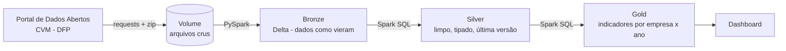

# Lakehouse de Demonstrações Financeiras da B3

Pipeline de engenharia de dados que coleta as demonstrações financeiras de **todas as companhias abertas do Brasil** (dados abertos da CVM), organiza em um **lakehouse com arquitetura medalhão** no **Databricks** e entrega **indicadores financeiros prontos para análise**: margem EBITDA, ROE, dívida líquida/EBITDA e crescimento de receita.

> Projeto construído por um analista de FP&A em transição para Engenharia de Dados. A proposta é unir as duas coisas: engenharia de verdade aplicada a um problema em que entender de contabilidade faz diferença.

---

## Arquitetura

| Camada | Tabelas | O que acontece |
|---|---|---|
| **Bronze** | `cvm.bronze.dfp_*_con`, `cvm.bronze.cadastro_cia` | CSVs da CVM gravados como vieram (tudo texto), com colunas de linhagem `_arquivo_origem` e `_carregado_em` |
| **Silver** | `cvm.silver.demonstracoes`, `cvm.silver.empresas` | DRE, balanço e DFC unificados; só o exercício corrente e a última versão; valores convertidos para reais |
| **Gold** | `cvm.gold.indicadores_anuais` | Uma linha por empresa x ano com receita, EBITDA, margens, ROE, endividamento e crescimento |

## Stack

**Databricks (Free Edition)** · **PySpark** · **Spark SQL** · **Delta Lake** · **Unity Catalog** · **Python** · **Git/GitHub**

## Estrutura do repositório

| Notebook | Função |
|---|---|
| `00_setup` | Cria o catálogo `cvm`, os schemas `bronze`/`silver`/`gold` e o volume de arquivos |
| `01_ingestao_bronze` | Baixa os arquivos DFP da CVM, descompacta e grava as tabelas bronze |
| `02_silver` | Limpeza, tipagem, deduplicação de versões e teste de fechamento do balanço |
| `03_gold` | Cálculo dos indicadores financeiros |

---

## Desafios dos dados (e como foram resolvidos)

Os dados públicos da CVM são ricos, mas têm armadilhas que só aparecem quando você olha com olhar de contabilidade:

**1. O mesmo ano aparece duas vezes.** Cada arquivo anual traz o exercício corrente (`ÚLTIMO`) e repete o anterior para comparação (`PENÚLTIMO`). Somar sem filtrar duplica a receita.
→ A silver mantém apenas `ORDEM_EXERC = 'ÚLTIMO'`.

**2. Reapresentações.** Quando a empresa corrige um balanço, entrega uma nova versão.
→ `QUALIFY` com `max(VERSAO)` por empresa, data e demonstração mantém só a versão mais recente.

**3. Escala dos valores.** A maioria das empresas reporta em milhares (`ESCALA_MOEDA = 'MIL'`), algumas em unidades.
→ Tudo é convertido para reais na silver.

**4. EBITDA não existe na DRE.** A DRE padronizada da CVM vai até o EBIT (conta 3.05). A depreciação e a amortização estão nos ajustes da DFC (contas 6.01.01.xx), que **não são padronizadas** entre empresas.
→ A gold localiza essas linhas pela descrição (`deprecia`, `amortiza`, `exaust`) e soma ao EBIT. O resultado é o **EBITDA contábil**, que pode diferir do *EBITDA ajustado* divulgado pelas empresas, já que este exclui itens não recorrentes.

**5. Bancos e seguradoras não são comparáveis.** A DRE de instituições financeiras tem outra estrutura (receita de intermediação financeira), então margens não fazem sentido ao lado de uma indústria.
→ A gold marca essas empresas com a coluna `eh_financeira`, para que as análises possam filtrá-las.

## Qualidade de dados

Teste de fechamento contábil: **Ativo total = Passivo + Patrimônio Líquido** para todas as empresas e anos.

Na primeira execução, o teste apontou apenas **2 divergências em centenas de empresas**, e ambas eram **arredondamento** de empresas que reportam em milhares (R$ 1 mil e R$ 330 de diferença em balanços de bilhões). O teste passou a usar uma tolerância proporcional: R$ 1 mil ou 0,01% do ativo, o que for maior.

## Validação com dado real

Receita líquida da Ambev calculada pelo pipeline, conferida com a divulgação da empresa:

| Ano | Receita líquida (R$ bi) | Margem EBITDA contábil |
|---|---|---|
| 2021 | 72,9 | 30,7% |
| 2022 | 79,7 | 29,6% |
| 2023 | 79,7 | 31,4% |
| 2024 | 89,5 | 32,3% |

---

## Como executar

1. Crie uma conta gratuita no [Databricks Free Edition](https://www.databricks.com/learn/free-edition).
2. Em **Workspace > Create > Git folder**, clone este repositório.
3. Execute os notebooks na ordem: `00_setup` → `01_ingestao_bronze` → `02_silver` → `03_gold`.

Fonte dos dados: [Portal de Dados Abertos da CVM](https://dados.cvm.gov.br/) (DFP e cadastro de companhias abertas).

## Próximos passos

- [ ] Orquestração com **Databricks Workflows** (execução agendada de ponta a ponta)
- [ ] Carga **incremental com `MERGE`** em vez de sobrescrita
- [ ] Inclusão dos **ITRs** (dados trimestrais)
- [ ] **Dashboard** comparando empresas e setores
- [ ] **CI com GitHub Actions**

---

**Autor:** Rodrigo · FP&A em transição para Engenharia de Dados
